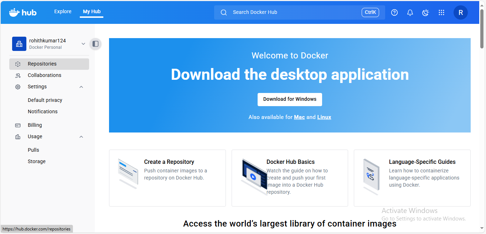
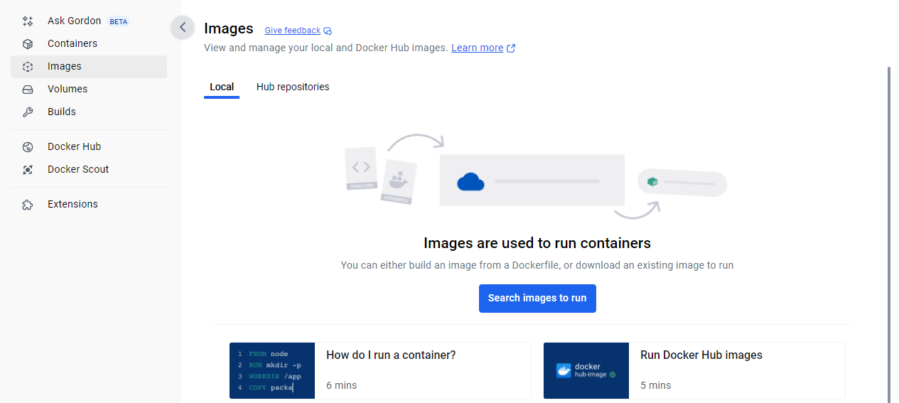
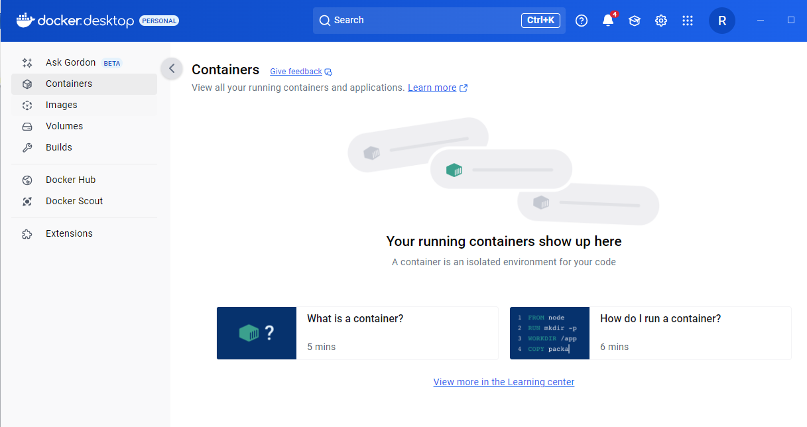
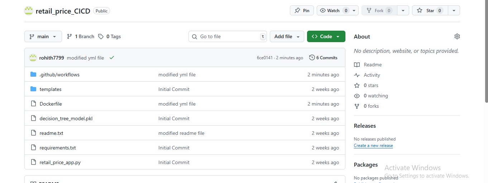
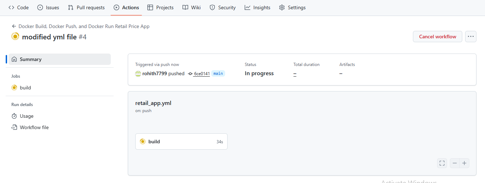
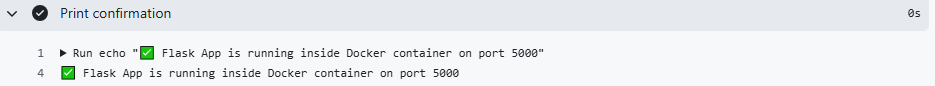
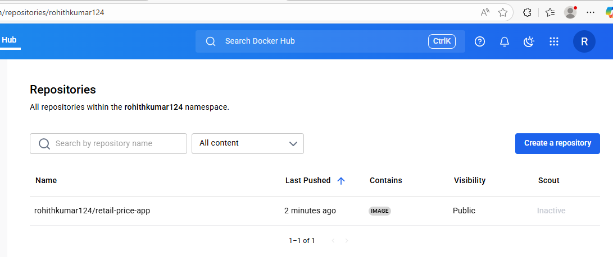

# 🛒 Retail Price Optimization using ML, Flask, Docker & GitHub Actions (CI/CD)

## 📌 Project Overview  
Retailers face challenges in **optimizing product prices**:  
- Overpricing reduces demand.  
- Underpricing cuts profit margins.  
- Traditional rule-based strategies fail to adapt to **market dynamics, competitor pricing, and seasonality**.  

This project delivers a **data-driven Retail Price Optimization system** that:  
- Uses a **Decision Tree Regressor** to recommend optimal prices.  
- Provides a **Flask web application** for predictions.  
- Is **containerized with Docker** for portability.  
- Implements **CI/CD with GitHub Actions**, automatically building, testing, and pushing the Docker image to **Docker Hub**.  

---

## 🎯 Aim  
To build and deploy a **dynamic retail pricing system** that analyzes sales, competition, logistics, and customer demand, enabling **real-time pricing recommendations** for profitability and competitiveness.  

---

## 🗂️ Project Workflow  
1. **Data Collection** – Retail product, sales, competitor, and logistics data.  
2. **Preprocessing & Feature Engineering** – Cleaning, lag prices, competitor pricing, temporal features.  
3. **EDA** – Demand trends, pricing vs competition, seasonal impacts.  
4. **Model Building** – Trained a **Decision Tree Regressor**.  
5. **Flask Application** – Exposes model via API + web UI.  
6. **Dockerization** – Packaged the app into a Docker image.  
7. **CI/CD Pipeline** – GitHub Actions automates Docker build & push to Docker Hub.  
8. **Deployment** – Docker Hub image can be run anywhere.  

---

## 📂 File Structure  
```
│── .github/
│ └── workflows/
│ └── retail_app.yml # GitHub Actions workflow (CI/CD pipeline)
│
│── screenshots/ # Project screenshots (used in README)
│ ├── screenshot_1.png
│ ├── screenshot_2.png
│ └── ...
│
│── templates/ # HTML templates for Flask frontend
│
│── decision_tree_model.pkl # Trained ML model (serialized)
│── retail_price_app.py # Flask application serving predictions
│── retail_price.csv # Dataset used for training
│── Retail Price Optimization.ipynb # Jupyter notebook (EDA + model training)
│── Dockerfile # Instructions to build Docker image
│── requirements.txt # Python dependencies
│── README.md # Project documentation
```
---

## 🛠️ Tools & Technologies  
- **Python** (ML & Flask)  
- **Libraries** – Pandas, NumPy, scikit-learn, Flask, Pickle  
- **Model** – Decision Tree Regressor  
- **Containerization** – Docker  
- **CI/CD** – GitHub Actions  
- **Registry** – Docker Hub  

---

## ⚙️ Setup & Installation  

### 🔹 Local Setup  
```bash
git clone https://github.com/<username>/<repo>.git
cd <repo>
pip install -r requirements.txt
python retail_price_app.py
```
Visit: `http://127.0.0.1:5000`

---

### 🔹 Docker Setup  
1. Build image locally:  
   ```bash
   docker build -t retail-price-app .
   ```
2. Run container:  
   ```bash
   docker run -p 5000:5000 retail-price-app
   ```
3. Visit: `http://localhost:5000`

---

### 🔹 GitHub Actions CI/CD  
Pipeline (`.github/workflows/retail_app.yml`) automates:  
1. Checkout repository.  
2. Login to Docker Hub.  
3. Build Docker image.  
4. Push image to Docker Hub (`username/retail-price-app:latest`).  
5. Run container inside GitHub Actions VM.  
6. Verify container logs.  

---

## 📸 Screenshots  

#### 🔹 Initial Empty Repository on Docker Hub  


#### 🔹 Empty Images in Docker Desktop  


#### 🔹 Empty Containers in Docker Desktop  


#### 🔹 GitHub Repository Setup  


#### 🔹 Running GitHub Actions Workflow  


#### 🔹 Application Running in GitHub Actions Console  


#### 🔹 Docker Hub Repository After Push  


---

## 📈 Key Results  
- ML model captured **non-linear price-demand relationships**.  
- Flask app enabled **real-time predictions**.  
- Dockerization ensured **portability across systems**.  
- CI/CD pipeline automated **build, push, and test process**.  

---

## 🔮 Future Enhancements  
- Improve model with **Random Forest, XGBoost, Neural Networks**.  
- Include **external signals** (promotions, inflation, seasonal trends).  
- Add **monitoring dashboards** (Streamlit, Power BI).  
- Deploy with **Kubernetes + Docker Compose** for scalability.  

---

## 📧 Contact  
**Author:** Rohith Kumar Thakur  
📩 Email: *[Your Email]*  
🌐 LinkedIn: *[Your LinkedIn]*  
